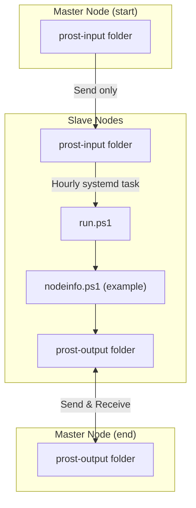

<div align="center">
  <h1>🍻 Prost</h1>
  <strong>Payload runner over Syncthing<br>Also, "Prost" means "Cheers" in German.</strong>
  
  <br>
  
  
  
  <br>
  
  [](https://github.com/khaffner/prost/actions/workflows/ci.yml)
  [](https://github.com/PowerShell/PowerShell)
  [](https://syncthing.net/)
  [](LICENSE)
  [](https://github.com/khaffner/prost/graphs/commit-activity)
  
  [](https://www.linux.org/)
  [](https://systemd.io/)
  [](https://github.com/khaffner/prost/issues)
  [](https://github.com/khaffner/prost/commits)
  [](CONTRIBUTING.md)
  
  [](https://github.com/khaffner/prost/stargazers)
  [](https://github.com/khaffner/prost/network/members)
  
</div>


---

## 🚀 What is Prost?

<sub><em>(Tip: You should be familiar with Syncthing before using this.)</em></sub>


Prost lets you manage your devices and servers. Push scripts, collect results, and automate tasks across your fleet, all with minimal setup, backed by Syncthing.

**Why?**
- Ensure packages are installed
- Make sure services are running
- Collect node info or logs
- ...and more


---

## 👤 Who is Prost for?

Not for enterprises, those should use mature solutions like Chef, Ansible, etc. Prost is my weird idea after learning Chef, but loving the decentralized nature and simplicity of Syncthing. Prost is for you who just want to push scripts and get results back, with no extra network config.

---

## 🛠️ Requirements

- **Systemd**
  - Cron would also work, but this project uses Systemd.
- **Syncthing**
  - Should run as a service at boot
  - `root` must be able to run `syncthing cli` at all times
- **PowerShell 7.4+**
  - Latest LTS
    - Waiting for 7.6 to release, so Debian 13 is properly supported.
  - PowerShell <3
    - Don't worry, other languages are also supported as payloads.

---

## ⚡ Quickstart

1. **Download latest release** to your master node (laptop, VM, etc). Syncthing must already be installed and running.

### On the Master Node
- Add `prost-input` as **Send Only** (slaves can't write back)
- Add `prost-output` as **Send & Receive** (shared dumping ground for outputs/logs)
- remove _template from the assignments csv
- Add your nodes and share both folders with them

### On Each "Slave" Node
- Accept both folders:
  - `prost-input` as **Receive Only**
  - `prost-output` as **Send & Receive**
- Run `install.ps1` to set up the systemd service (runs `run.ps1` every hour, adjust as needed)

### Want another Master Node?
- Share both folders between all Master Nodes as **Send & Receive**

---

## 📝 Assigning Scripts & Getting Results

1. **Pause** the `prost-input` folder in Syncthing on the master node you work on. (prevents accidental WIP deployments). [CLI tip](https://forum.syncthing.net/t/stcli-or-how-to-pause-resume-sync-from-cli-in-2022/19345/2)
2. **Create your script** in [`prost-input/payloads/`](prost-input/payloads/). (Try `nodeinfo.ps1` as a starter!)
3. **Assign nodes** in [`assignments.csv`](prost-input/assignments.csv)
   - Use only the first section of the Syncthing ID
4. **Unpause** the `prost-input` folder to sync scripts to your nodes

**What happens next?**

1. Files sync to the slave node
2. The slave node runs `run.ps1` hourly
3. `run.ps1` decides what/how to run
4. Scripts may write output to `prost-output`

---

## 🔄 System Flow Diagram



---

## 🧪 Development & Testing

Before committing changes, run the test suite locally:

```bash
pwsh .github/test.ps1
```

This runs the same checks as the CI pipeline:
- **PSScriptAnalyzer** - Code quality and best practices
- **Syntax validation** - Ensures all scripts parse correctly
- **CSV validation** - Checks assignments.csv format
- **Security analysis** - Scans for common security issues

Tests run automatically on every push and pull request via GitHub Actions.

---

<div align="center">
  <strong>🍻 Prost!</strong>
</div>