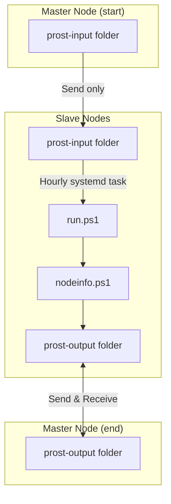

<div align="center">
  <h1>🍻 Prost</h1>
  <strong>(WIP)<br>Payload runner over Syncthing<br>"Prost" means "Cheers" in German so there's also that.</strong>
  
  <br><br>
  
  [](https://github.com/khaffner/prost/actions/workflows/test.yml)
  [](https://github.com/khaffner/prost/actions/workflows/release.yml)
  [](https://github.com/PowerShell/PowerShell)
  [](https://syncthing.net/)
  
</div>


---

## 🚀 What is Prost?

<sub><em>(Tip: You should be familiar with Syncthing before using this.)</em></sub>


Prost lets you manage your devices and servers. No network headaches, no SSH tunnels. Just Syncthing magic. Push scripts, collect results, and automate tasks across your fleet, all with minimal setup.

**Why?**
- Ensure packages are installed
- Make sure services are running
- Collect node info or logs
- ...and more, with your own scripts!


---

## 👤 Who is Prost for?

Not for enterprises. Use Chef, Ansible, etc. Prost is my weird idea after being exposed to chef. Prost is for you who just want to push scripts and get results back, with zero network config. (Yes, it could be a security nightmare, so use strong passwords and disk encryption, especially on your master node!)

---

## 🛠️ Requirements

- **systemd**
- **Syncthing**
  - Should run as a service at boot
  - `root` must be able to run `syncthing cli show system` at all times
- **PowerShell 7.4+**
  - Latest LTS (only version properly supported by Debian 13)
  - PowerShell <3
    - Don't worry, other languages are also supported as payloads

---

## ⚡ Quickstart

1. **Download latest release** to your master node (laptop, VM, etc). Syncthing must already be installed and running.

### On the Master Node
- Add `prost-input` as **Send Only** (slaves can't write back)
- Add `prost-output` as **Send & Receive** (shared dumping ground for outputs/logs)
- remove _template from the assignments csv
- Add your nodes and share both folders with them

### On Each "Slave" Node
- Accept both folders:
  - `prost-input` as **Receive Only**
  - `prost-output` as **Send & Receive**
- Run `install.ps1` to set up the systemd service (runs `run.ps1` every hour, adjust as needed)

---

## 📝 Assigning Scripts & Getting Results

1. **Pause** the `prost-input` folder in Syncthing (prevents accidental WIP deployments). [CLI tip](https://forum.syncthing.net/t/stcli-or-how-to-pause-resume-sync-from-cli-in-2022/19345/2)
2. **Create your script** in [`prost-input/payloads/`](prost-input/payloads/). (Try `nodeinfo.ps1` as a starter!)
3. **Assign nodes** in [`assignments.csv`](prost-input/assignments.csv)
   - Use only the first section of the Syncthing ID
4. **Unpause** the `prost-input` folder to sync scripts to your nodes

**What happens next?**

1. Files sync to the node
2. The node runs `run.ps1` hourly
3. `run.ps1` decides what/how to run
4. Scripts may write output to `prost-output`
5. The master node (or an optional "reporting" node) receives the output for review

---

## 🔄 System Flow Diagram



---

## 🧪 Development & Testing

Before committing changes, run the test suite locally:

```bash
pwsh test.ps1
```

This runs the same checks as the CI pipeline:
- **PSScriptAnalyzer** - Code quality and best practices
- **Syntax validation** - Ensures all scripts parse correctly
- **CSV validation** - Checks assignments.csv format
- **Security analysis** - Scans for common security issues

Tests run automatically on every push and pull request via GitHub Actions.

---

<div align="center">
  <strong>🍻 Prost!</strong>
</div>